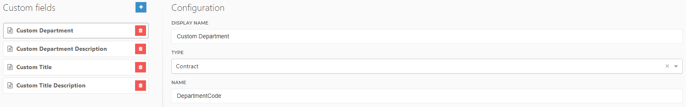
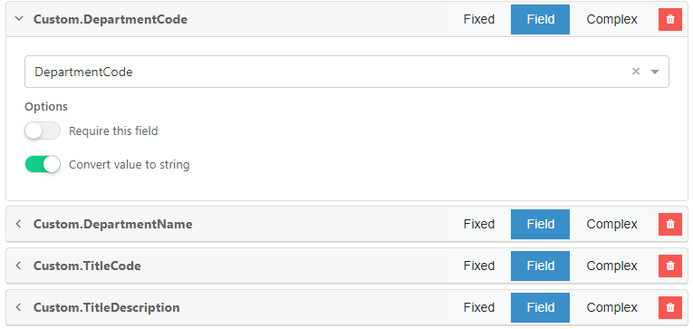
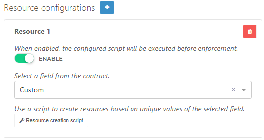
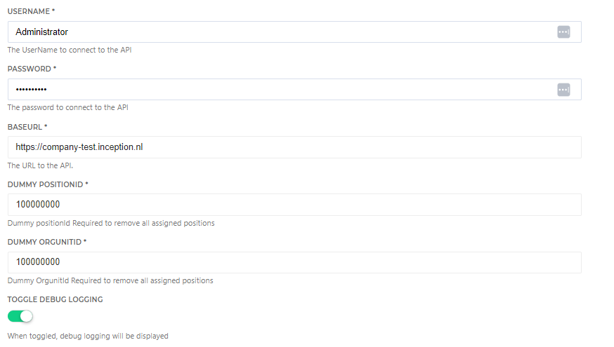

# HelloID-Conn-Prov-Target-Inception

> [!IMPORTANT]
> This repository contains the connector and configuration code only. The implementer is responsible to acquire the connection details such as username, password, certificate, etc. You might even need to sign a contract or agreement with the supplier before implementing this connector. Please contact the client's application manager to coordinate the connector requirements.

<p align="center">
  
</p>

## Table of contents

- [HelloID-Conn-Prov-Target-Inception](#helloid-conn-prov-target-Inception)
  - [Table of contents](#table-of-contents)
  - [Introduction](#introduction)
  - [Getting started](#getting-started)
    - [Provisioning PowerShell V2 connector](#provisioning-powershell-v2-connector)
      - [Correlation configuration](#correlation-configuration)
      - [Field mapping](#field-mapping)
    - [Connection settings](#connection-settings)
    - [Prerequisites](#prerequisites)
    - [Remarks](#remarks)
  - [Setup the connector](#setup-the-connector)
  - [Getting help](#getting-help)
  - [HelloID docs](#helloid-docs)

## Introduction

_HelloID-Conn-Prov-Target-Inception_ is a _target_ connector. _Inception_ provides a set of REST API's that allow you to programmatically interact with its data. The HelloID connector uses the API endpoints listed in the table below.

| Endpoint               | Description                     |
| ---------------------- | ------------------------------- |
| /authentication/login  | Endpoint for authorization code |
| /api/v2/security/users | User actions                    |
| /api/v2/hrm/employees  | Employee actions                |
| /api/v2/hrm/employees  | Organisation resource actions   |
| /api/v2/hrm/orgunits   | Position resource actions       |

The following lifecycle actions are available:

| Action             | Description                             |
| ------------------ | --------------------------------------- |
| create.ps1         | PowerShell _create_ lifecycle action    |
| delete.ps1         | PowerShell _delete_ lifecycle action    |
| disable.ps1        | PowerShell _disable_ lifecycle action   |
| enable.ps1         | PowerShell _enable_ lifecycle action    |
| update.ps1         | PowerShell _update_ lifecycle action    |
| resources.ps1      | PowerShell _resources_ lifecycle action |
| configuration.json | Default _configuration.json_            |
| fieldMapping.json  | Default _fieldMapping.json_             |

## Getting started

### Provisioning PowerShell V2 connector

#### Correlation configuration

The correlation configuration is used to specify which properties will be used to match an existing account within _Inception_ to a person in _HelloID_.

To properly setup the correlation:

1. Open the `Correlation` tab.

2. Specify the following configuration:

   | Setting                   | Value                             |
   | ------------------------- | --------------------------------- |
   | Enable correlation        | `True`                            |
   | Person correlation field  | `PersonContext.Person.ExternalId` |
   | Account correlation field | `staffnumber`                     |

> [!TIP] 
> _For more information on correlation, please refer to our correlation [documentation](https://docs.helloid.com/en/provisioning/target-systems/powershell-v2-target-systems/correlation.html) pages_.

#### Field mapping

The field mapping can be imported by using the _fieldMapping.json_ file.

### Connection settings

The following settings are required to connect to the API.

| Setting          | Description                                      | Mandatory |
| ---------------- | ------------------------------------------------ | --------- |
| UserName         | The UserName to connect to the API               | Yes       |
| Password         | The Password to connect to the API               | Yes       |
| BaseUrl          | The URL to the API                               | Yes       |
| Dummy PositionId | The Id of a Dummy Position in Inception          | Yes       |
| Dummy OrgunitId  | The Id of a Dummy Organization Unit in Inception | Yes       |

### Prerequisites

- API Connection settings
- Inception Dummy Position and Organization Unit :information*source: \_See [Positions](#positions)*
- Custom properties or complex mapping to create a combination of title and department. :information*source: \_See [Remarks Resources](#remarks-resources)*
- An Inception custom overview to retrieve employees that can be filtered based on the staff number. _See [General](#general)_

### Remarks

#### General

- In the account creation process, the newly created accounts are disabled afterward using an additional web call. This is necessary because the web service does not support creating accounts in a disabled state. However, if an account already exists, the connector does not perform a disable action to avoid unintended behavior.
- The end date on the employee and account is informational. The employee account has an active/inactive state, and the user account can be either deleted or created. Therefore, the end date is not actively used unless an object already has an end date, in which case the end date is cleared.
- The relationship between the employee and user is 1 = 1. The employee object is managed throughout its entire lifecycle, while the user object is only managed during Enable and Disable process. Where the object is Created or Deleted.
- The password is a mandatory value according to the webservice, even if it is not utilized due to Single Sign-On (SSO) being in place.

#### Correlation

- The Staffnumber is not unique, and during the correlation process, it's possible to retrieve more than one account based on this property. The connector checks if there is exactly one active account and correlates that account. However, if there are multiple or no accounts found, the connector is unable to correlate a single account and throws an error.
  - In such cases, manual intervention is required to either remove the duplicate accounts or ensure that only the correct account is marked as active. This will help resolve the issue and ensure accurate correlation of the accounts.

#### Positions

- Additionally, the employee account includes positions that are required. These positions are dynamically calculated based on the contract and conditions. In the create and update script, there is script configuration to specify the lookup value from HelloId, which is used to match the positions and/or organizational units in Inception.
  _The configuration is found in the Create and Update actions._
  ```Powershell
    # Script Configuration
    $departmentLookupProperty = { $_.Department.ExternalId }
    $titleLookupProperty = { $_.Title.ExternalId }
  ```
- For existing Inception employees, their current positions are retained, and the connector only manages positions that are calculated in HelloId. However, it also checks if the desired positions in HelloId are already present and correlates them accordingly. It's important to note that HelloId may remove a position after it has been initially correlated. The connector ignores positions that are never set or correlated from HelloId.
- The connector currently uses a "get List" call for looking up positions and org units. However, this approach can impose a heavy load in a production environment. It is advisable to consider changing it to utilize a CSV file along with a resource script for more efficient handling of these lookups.
- When there are missing titles or departments that cannot be translated to positions and org units in Inception, the Connector will raise an error. In such cases, it might be necessary to run the enforcement process with resources to ensure that all required titles and departments are properly created.

#### Dummy Position

In the Delete action, the positions managed by HelloID are removed from the Inception Employee account. However, the Employee account must always have a linked position. Therefore, in order to remove the "Latest" position, the connector requires an available dummy position that can be added instead. It is necessary to fill in the configuration with the IDs of the organization and position for this purpose.

<p>
  
</p>

- :warning: The value's in the resource script need to correspond to the lookup field in the configuration.
- The resource script creates orgUnits and positions in Inception.
- The resource script links the orgUnit to the right position, that's why there are linking custom properties.
- The resource script does not disable or delete orgUnits or positions.
- The resource script checks if the object in $rRef has a department code otherwise the object contains different custom fields.
- When an orgUnit or position has a state of 30 (inactive) in the target system we update it to 20 (active) to activate that orgUnit or position.
- Create a Custom field To create a linking table between departments and titles.
- The resource script uses the custom properties DepartmentCode, DepartmentName, TitleCode, and TitleDescription. For more information on custom properties please refer to our [docs](https://docs.helloid.com/en/provisioning/persons/person-schema/add-a-custom-person-or-contract-field.html) page. see 1st image.
- Map the custom fields to the correct values in the source system. See 2nd image.
- Using multiple custom fields in the resource script is possible by selecting the whole custom object when configuring the resource script. See 3rd image.
<p>
  
</p>
<p>
  
</p>
<p>
  
</p>

## Setup the connector

_How to setup the connector in HelloID._

<p>
  
</p>

Besides the configuration tab, you can also configure script variables. To decide which property from a HelloId contract is used to look up a value. Please note that some "same" configuration must be taken place in multiple scripts. Shown as below:

### Create.ps1

```Powershell
  # Script Configuration
  $departmentLookupProperty = { $_.Department.ExternalId }
  $titleLookupProperty = { $_.Title.ExternalId }
```

### Update.ps1

```Powershell
  # Script Configuration
  $departmentLookupProperty = { $_.Department.ExternalId }
  $titleLookupProperty = { $_.Title.ExternalId }
```

## Getting help

> [!TIP] 
> _For more information on how to configure a HelloID PowerShell connector, please refer to our [documentation](https://docs.helloid.com/en/provisioning/target-systems/powershell-v2-target-systems.html) pages_.

> [!TIP] 
> \_If you need help, feel free to ask questions on our [forum](https://forum.helloid.com/forum/helloid-connectors/provisioning/4792-helloid-conn-prov-target-inception)

## HelloID docs

The official HelloID documentation can be found at: https://docs.helloid.com/
